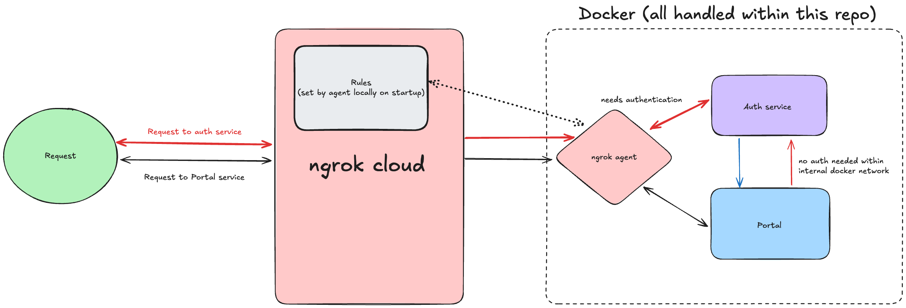
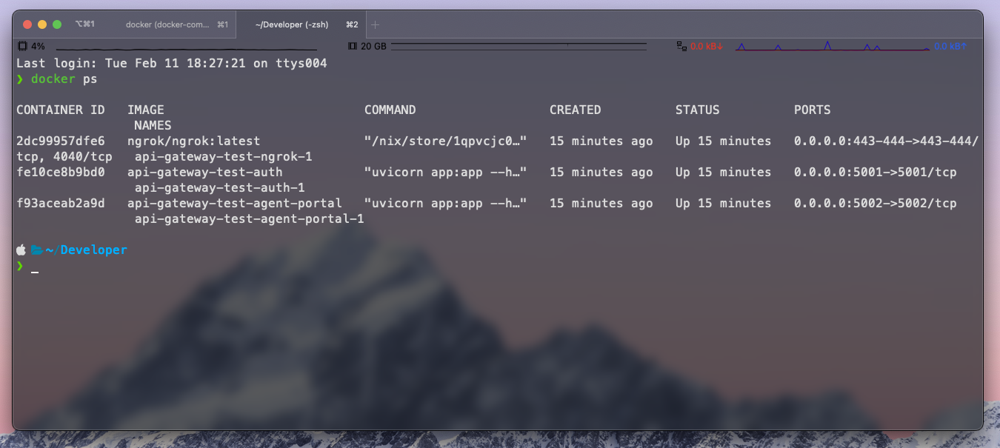
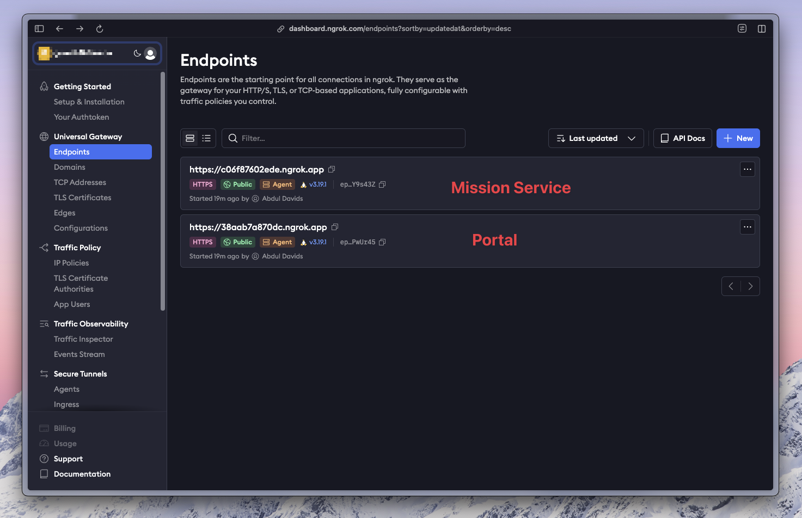
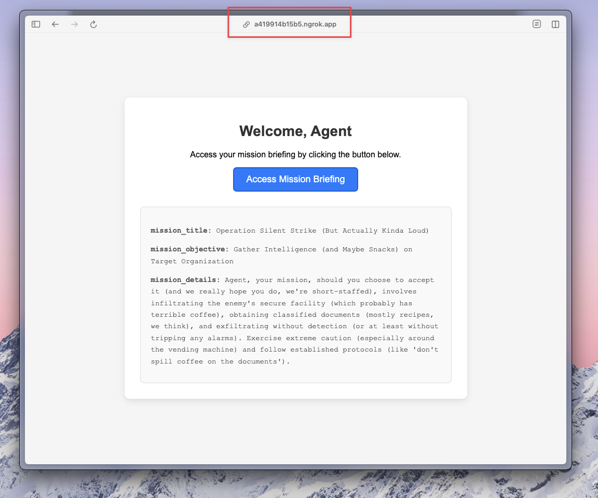
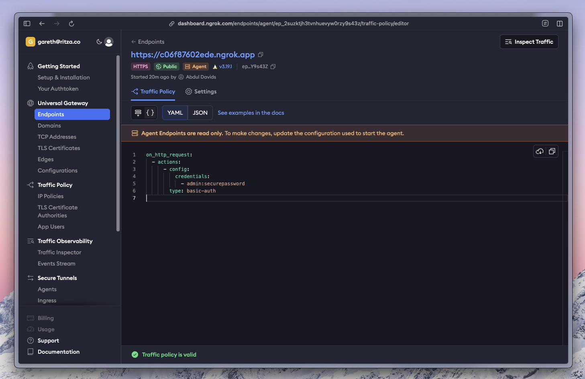
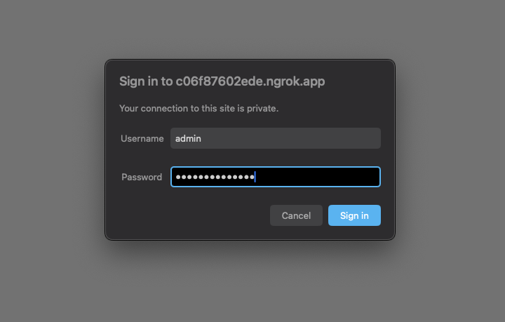
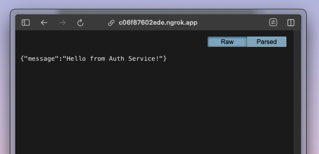
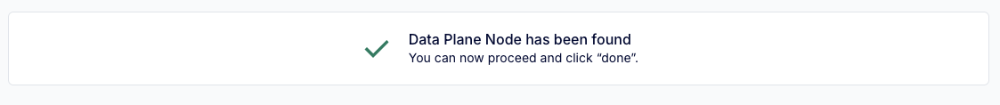

# Setting Up ngrok as an API gateway

In this guide, we'll set up an ngrok agent as an API gateway to expose multiple services running on Docker containers. 

We'll also show the equivalent setup using Kong as an API gateway.

## The setup

This is a basic setup with two services: `auth-service` and `agent-portal`.



The `agent-portal` service contains a really simple frontend that makes a request to the `auth-service` for authentication and fetches a secret message for James Bond.

The `auth-service` should ideally have some traffic policies in place to ensure only authenticated requests are allowed. In this example, we'll add basic authentication using ngrok's traffic policies to add a username and password. This way, the `agent-portal` service can freely make requests to the `auth-service` without worrying about authentication, while any external requests will need to provide the correct credentials.


## 1. Sign Up and Get an ngrok API Key

1. Go to ngrok.com and sign up
2. Navigate to the "Authtokens" section in the ngrok dashboard
3. Copy your Authtoken

## 2. Install the ngrok agent

### On macOS (Homebrew):
```bash
brew install ngrok
```

Next we can authenticate ngrok (not entirely necessary since we'll use a config file but helpful for testing locally):

```bash
ngrok config add-authtoken <YOUR_NGROK_AUTH_TOKEN>
```

## 3. Clone the repository

Next, clone the repository and checkout the `ngrok-agent` branch:

```bash
git clone <this-repo-url> 

cd api-gateway-test

git checkout ngrok-agent
```


## 4. Create ngrok.yml

Create a `ngrok` directory in the root of the project and add an `ngrok.yml` file with the following configuration:

```yaml
version: "3"
agent:
  authtoken: "YOUR_NGROK_AUTH_TOKEN"

endpoints:
  - name: auth-endpoint
    upstream:
      url: http://auth:5001
    traffic_policy:
      on_http_request:
        - actions:
            - type: basic-auth
              config:
                credentials:
                  - "admin:super-secret-password"

  - name: agent-portal-endpoint
    upstream:
      url: http://agent-portal:5002
```

This configuration sets up two endpoints: `auth-endpoint` and `agent-portal-endpoint`. The `auth-endpoint` has an authentication policy in place.

Our ngrok agent can use this configuration on startup.


## 5. Modify docker-compose.yml

We'll add an ngrok agent service to our `docker-compose.yml` file. We'll also add a network to allow the services to communicate with each other and we'll add the config file for the ngrok agent as a volume.

This service will forward traffic to our auth and agent-portal services. 

```yaml
version: '3.8'

services:
  auth:
    build: ./auth-service
    ports:
      - "5001:5001"

  agent-portal:
    build: ./agent-portal
    ports:
      - "5002:5002"

  ngrok:
    image: ngrok/ngrok:latest 
    command: "start --all --config /etc/ngrok/ngrok.yml"
    volumes:
      - ./ngrok/ngrok.yml:/etc/ngrok/ngrok.yml
    depends_on:
      - auth
      - agent-portal
    ports:
      - "443:443"
      - "4040:4040"
```

## 6. Start Services

Start the services using Docker Compose:

```bash
docker-compose up --build
```

List running containers to verify that the services are running:

```bash
docker ps
```




## Check ngrok Dashboard

Visit your ngrok dashboard to see the endpoints and inspect the traffic policies.



Clicking on the endpoint that corresponds to the agent portal should show our agent portal:



Clicking on the endpoint that corresponds to the auth service should show the traffic policy:



And we can verfy this by going to the auth-service endpoint:



Enter the credentials and you should see the auth hello message:



# Setting up Kong as an API gateway

After signing up for Kong Konnect and creating a Hybrid Self-Hosted Service, Kong will provide you with a Docker run script from the Konnect dashboard. This script is required to start the Kong Gateway as a data plane that connects to Konnect’s control plane.


## 1. Sign Up and Create a Hybrid Gateway in Konnect

1. **Go to Kong Konnect and sign up.**
2. **Navigate to Gateway Manager → Create a New Gateway.**
3. **Select _Self-Managed Hybrid_ as the deployment method.**


4. **You'll see a list of methods to run the gateway locally, for this guide we'll use Docker.**


You’ll also see a pre-configured Docker run command that looks like this:

```bash
docker run -d \
  -e "KONG_ROLE=data_plane" \
  -e "KONG_DATABASE=off" \
  -e "KONG_VITALS=off" \
  -e "KONG_CLUSTER_MTLS=pki" \
  -e "KONG_CLUSTER_CONTROL_PLANE=<your-control-plane>.us.cp0.konghq.com:443" \
  -e "KONG_CLUSTER_SERVER_NAME=<your-control-plane>.us.cp0.konghq.com" \
  -e "KONG_CLUSTER_TELEMETRY_ENDPOINT=<your-control-plane>.us.tp0.konghq.com:443" \
  -e "KONG_CLUSTER_TELEMETRY_SERVER_NAME=<your-control-plane>.us.tp0.konghq.com" \
  -e "KONG_CLUSTER_CERT=<your-cluster-cert>" \
  -e "KONG_CLUSTER_CERT_KEY=<your-cluster-cert-key>" \
  -e "KONG_LUA_SSL_TRUSTED_CERTIFICATE=system" \
  -e "KONG_KONNECT_MODE=on" \
  -e "KONG_CLUSTER_DP_LABELS=created-by:docker,env:production" \
  -p 8000:8000 \
  -p 8443:8443 \
  kong/kong-gateway:latest
```

This command configures the data plane node to connect to Konnect's control plane, enabling remote management while maintaining local traffic handling. The container exposes standard HTTP and HTTPS ports for API traffic.

If the connection to Konnect’s control plane is successful, you should see a message like this:




## 2. Register Services and Routes in using DecK

Next, we'll use decK to register services and routes with our gateway

### Install decK

- **macOS:**

  ```bash
  brew install kong/deck/deck
  ```

### Define a `kong.yaml`

Create a file named `kong.yaml` with the following content:

```yaml
_format_version: "3.0"

services:
  - name: auth-service
    url: http://localhost:5001
    routes:
      - name: auth-route
        paths:
          - /auth

  - name: agent-portal
    url: http://localhost:5002
    routes:
      - name: agent-portal-route
        paths:
          - /agent-portal

plugins:
  - name: rate-limiting
    service: auth-service
    config:
      minute: 20
      policy: local

  - name: rate-limiting
    service: agent-portal
    config:
      minute: 50
      policy: local

  - name: basic-auth
    service: auth-service
```

The configuration establishes rate limiting and authentication policies for both services. The auth service receives stricter rate limits and requires basic authentication.

### Sync Configuration with Konnect

Run the following command to apply the configuration:

```bash
deck sync --state kong.yaml \
  --konnect-control-plane-name="Local Docker container agent portal" \
  --konnect-token="<your-konnect-token>"
```

This synchronization applies the local configuration to your Kong control plane, establishing the defined services and policies.

## 3. Test Public Access to the Services

### Testing Rate Limits

```bash
for i in {1..21}; do curl -X GET https://<your-kong-konnect-host>:8000/auth; done
```

*Expected result:* The 21st request should return `429 Too Many Requests`.


## 4. Make Kong Gateway Fully Public

Unlike ngrok, Kong does not automatically provide a public URL. You need to expose it manually.


# Setting up Cloudflare Tunnel as an API gateway