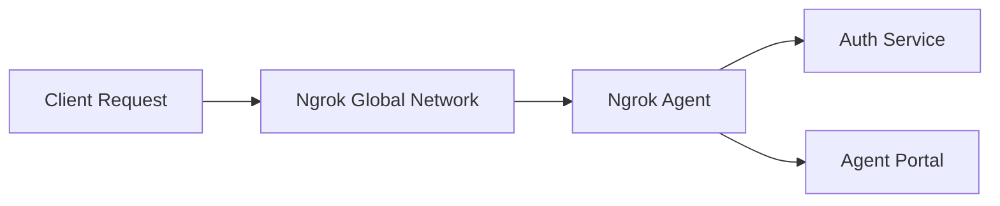
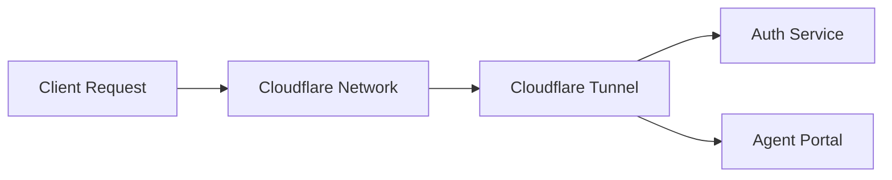

# A Guide to API Gateways: Ngrok, Kong, and Cloudflare Tunnel

This guide explores three popular API gateway options—Ngrok, Kong, and Cloudflare Tunnel—focusing on their architecture, ease of use, and overall usability. Understanding these differences will help you decide which solution fits best with your environment.

## Overview

Each of these gateways works as an intermediary between your clients and backend services. They handle incoming requests, enforce security or traffic policies, and route traffic to your services. However, they differ in design and operation:
- **Ngrok** offers a lightweight, flexible approach. It acts as a global entry point where you can apply universal rules like rate limiting or basic authentication. Its unopinionated design means it can easily integrate with hybrid or multi-cloud setups.
- **Kong** takes a traditional API gateway route, splitting responsibilities between a data plane (handling API traffic) and a centralized control plane for configuration and policy management. This model suits environments that demand granular control and detailed traffic management.
- **Cloudflare Tunnel** leverages Cloudflare’s vast network. By exposing your services using your own domain, it provides a secure way to route traffic through Cloudflare’s infrastructure. This approach benefits from built-in security features without exposing your public IP.

## Ngrok Architecture

Ngrok’s model is built around simplicity and speed. In this architecture, every client request first passes through Ngrok’s global network, where you can enforce universal rules, before being directed by a local Ngrok agent to your backend services.



**Explanation:**
A request from a client enters Ngrok’s global network, where broad traffic policies—such as rate limiting or basic authentication—can be applied. The Ngrok agent running in your environment then takes over, routing the request to the appropriate backend service (for example, an authentication service or a user portal). This model emphasizes ease of setup and flexibility, making it ideal for rapid development or environments with mixed infrastructure.

## Kong Architecture

Kong divides responsibilities between a data plane that directly handles client requests and a control plane that manages configuration and policies. This separation allows for robust management of API traffic and detailed control over service routes and security policies.


**Explanation:**
In this design, a client’s request is received by the Kong Gateway (the data plane). The gateway then forwards the request to the appropriate backend service while simultaneously consulting with the Kong Control Plane to enforce centralized policies and configurations. This setup is especially powerful for larger or more complex environments where detailed traffic control and monitoring are required.

## Cloudflare Tunnel Architecture

Cloudflare Tunnel uses Cloudflare’s global network to secure and expose your services. With this model, your own domain is used to route traffic securely to your local services through Cloudflare’s infrastructure, taking advantage of its extensive security and performance features.



**Explanation:**
Here, a client’s request is directed to your domain, which is served by Cloudflare’s global network. The Cloudflare Tunnel, acting as a secure intermediary, receives the request and forwards it to the relevant backend service. This method minimizes exposure of your internal IP addresses and leverages Cloudflare’s security measures, making it particularly useful if you’re already managing your domain through Cloudflare.

## Summary

Choosing the right API gateway depends on your specific needs:
- **Ngrok** is a great option when you need a fast, flexible solution that is easy to set up, especially for hybrid or multi-cloud environments.
- **Kong** is suited for scenarios where you need comprehensive traffic management and centralized control, ideal for larger or more complex deployments.
- **Cloudflare Tunnel** offers secure, domain-based exposure of your services, integrating well with Cloudflare’s network and security features.

By understanding these architectural differences and the focus of each tool, you can better align your choice of API gateway with your operational requirements and infrastructure strategy.

# Setting Up ngrok as an API gateway

In this guide, we'll set up an ngrok agent as an API gateway to expose multiple services running on Docker containers. 

We'll also show the equivalent setup using Kong as an API gateway.

## The setup

This is a basic setup with two services: `auth-service` and `agent-portal`.


The `agent-portal` service contains a really simple frontend that makes a request to the `auth-service` for authentication and fetches a secret message for James Bond.

The `auth-service` should ideally have some traffic policies in place to ensure only authenticated requests are allowed. In this example, we'll add basic authentication using ngrok's traffic policies to add a username and password. This way, the `agent-portal` service can freely make requests to the `auth-service` without worrying about authentication, while any external requests will need to provide the correct credentials.


## 1. Sign Up and Get an ngrok API Key

1. Go to ngrok.com and sign up
2. Navigate to the "Authtokens" section in the ngrok dashboard
3. Copy your Authtoken

## 2. Install the ngrok agent

### On macOS (Homebrew):
```bash
brew install ngrok
```

Next we can authenticate ngrok (not entirely necessary since we'll use a config file but helpful for testing locally):

```bash
ngrok config add-authtoken <YOUR_NGROK_AUTH_TOKEN>
```

## 3. Clone the repository

Next, clone the repository and checkout the `ngrok-agent` branch:

```bash
git clone <this-repo-url> 

cd api-gateway-test

git checkout ngrok-agent
```


## 4. Create ngrok.yml

Create a `ngrok` directory in the root of the project and add an `ngrok.yml` file with the following configuration:

```yaml
version: "3"
agent:
  authtoken: "YOUR_NGROK_AUTH_TOKEN"

endpoints:
  - name: auth-endpoint
    upstream:
      url: http://auth:5001
    traffic_policy:
      on_http_request:
        - actions:
            - type: basic-auth
              config:
                credentials:
                  - "admin:super-secret-password"

  - name: agent-portal-endpoint
    upstream:
      url: http://agent-portal:5002
```

This configuration sets up two endpoints: `auth-endpoint` and `agent-portal-endpoint`. The `auth-endpoint` has an authentication policy in place.

Our ngrok agent can use this configuration on startup.


## 5. Modify docker-compose.yml

We'll add an ngrok agent service to our `docker-compose.yml` file. We'll also add a network to allow the services to communicate with each other and we'll add the config file for the ngrok agent as a volume.

This service will forward traffic to our auth and agent-portal services. 

```yaml
version: '3.8'

services:
  auth:
    build: ./auth-service
    ports:
      - "5001:5001"

  agent-portal:
    build: ./agent-portal
    ports:
      - "5002:5002"

  ngrok:
    image: ngrok/ngrok:latest 
    command: "start --all --config /etc/ngrok/ngrok.yml"
    volumes:
      - ./ngrok/ngrok.yml:/etc/ngrok/ngrok.yml
    depends_on:
      - auth
      - agent-portal
    ports:
      - "443:443"
      - "4040:4040"
```

## 6. Start Services

Start the services using Docker Compose:

```bash
docker-compose up --build
```

List running containers to verify that the services are running:

```bash
docker ps
```


## Check ngrok Dashboard

Visit your ngrok dashboard to see the endpoints and inspect the traffic policies.


Clicking on the endpoint that corresponds to the agent portal should show our agent portal:


Clicking on the endpoint that corresponds to the auth service should show the traffic policy:


And we can verfy this by going to the auth-service endpoint:


Enter the credentials and you should see the auth hello message:


# Setting up Kong as an API gateway

After signing up for Kong Konnect and creating a Hybrid Self-Hosted Service, Kong will provide you with a Docker run script from the Konnect dashboard. This script is required to start the Kong Gateway as a data plane that connects to Konnect’s control plane.


## 1. Sign Up and Create a Hybrid Gateway in Konnect

1. **Go to Kong Konnect and sign up.**
2. **Navigate to Gateway Manager → Create a New Gateway.**
3. **Select _Self-Managed Hybrid_ as the deployment method.**


4. **You'll see a list of methods to run the gateway locally, for this guide we'll use Docker.**


You’ll also see a pre-configured Docker run command that looks like this:

```bash
docker run -d \
  -e "KONG_ROLE=data_plane" \
  -e "KONG_DATABASE=off" \
  -e "KONG_VITALS=off" \
  -e "KONG_CLUSTER_MTLS=pki" \
  -e "KONG_CLUSTER_CONTROL_PLANE=<your-control-plane>.us.cp0.konghq.com:443" \
  -e "KONG_CLUSTER_SERVER_NAME=<your-control-plane>.us.cp0.konghq.com" \
  -e "KONG_CLUSTER_TELEMETRY_ENDPOINT=<your-control-plane>.us.tp0.konghq.com:443" \
  -e "KONG_CLUSTER_TELEMETRY_SERVER_NAME=<your-control-plane>.us.tp0.konghq.com" \
  -e "KONG_CLUSTER_CERT=<your-cluster-cert>" \
  -e "KONG_CLUSTER_CERT_KEY=<your-cluster-cert-key>" \
  -e "KONG_LUA_SSL_TRUSTED_CERTIFICATE=system" \
  -e "KONG_KONNECT_MODE=on" \
  -e "KONG_CLUSTER_DP_LABELS=created-by:docker,env:production" \
  -p 8000:8000 \
  -p 8443:8443 \
  kong/kong-gateway:latest
```

This command configures the data plane node to connect to Konnect's control plane, enabling remote management while maintaining local traffic handling. The container exposes standard HTTP and HTTPS ports for API traffic.

If the connection to Konnect’s control plane is successful, you should see a message like this:


## 2. Register Services and Routes in using DecK

Next, we'll use decK to register services and routes with our gateway

### Install decK

- **macOS:**

  ```bash
  brew install kong/deck/deck
  ```

### Define a `kong.yaml`

Create a file named `kong.yaml` with the following content:

```yaml
_format_version: "3.0"

services:
  - name: auth-service
    url: http://localhost:5001
    routes:
      - name: auth-route
        paths:
          - /auth

  - name: agent-portal
    url: http://localhost:5002
    routes:
      - name: agent-portal-route
        paths:
          - /agent-portal

plugins:
  - name: rate-limiting
    service: auth-service
    config:
      minute: 20
      policy: local

  - name: rate-limiting
    service: agent-portal
    config:
      minute: 50
      policy: local

  - name: basic-auth
    service: auth-service
```

The configuration establishes rate limiting and authentication policies for both services. The auth service receives stricter rate limits and requires basic authentication.

### Sync Configuration with Konnect

Run the following command to apply the configuration:

```bash
deck sync --state kong.yaml \
  --konnect-control-plane-name="Local Docker container agent portal" \
  --konnect-token="<your-konnect-token>"
```

This synchronization applies the local configuration to your Kong control plane, establishing the defined services and policies.

## 3. Test Public Access to the Services

### Testing Rate Limits

```bash
for i in {1..21}; do curl -X GET https://<your-kong-konnect-host>:8000/auth; done
```

*Expected result:* The 21st request should return `429 Too Many Requests`.


## 4. Make Kong Gateway Fully Public

Unlike ngrok, Kong does not automatically provide a public URL. You need to expose it manually.


# Setting up Cloudflare Tunnel as an API Gateway

In this guide, we’ll set up Cloudflare Tunnel as an API Gateway to expose multiple services running on Docker containers. This method allows you to securely route traffic to your local services without exposing your public IP or opening firewall ports.

We’ll also show how to enforce authentication and rate limiting using Cloudflare’s security features.

## 1. Sign Up and Create a Cloudflare Tunnel

1. Go to Cloudflare Dashboard and sign up.
2. Navigate to Zero Trust → Access → Tunnels.
3. Click “Create a Tunnel”.
4. Give your tunnel a name (e.g., my-api-gateway).
5. Select “Docker” as the installation method.

Cloudflare will provide a Docker run command that looks like this:

```bash
docker run -d --name cloudflared \
  cloudflare/cloudflared:latest tunnel --no-autoupdate run --token <YOUR_CLOUDFLARE_TUNNEL_TOKEN>
```

This command starts the Cloudflare Tunnel agent, which connects your local machine to Cloudflare’s network.

## 2. Start API Services

Next, start your local services. These will be exposed through the Cloudflare Tunnel.

```bash
docker run -d --name auth-service -p 5001:5001 your-auth-service-image
docker run -d --name agent-portal -p 5002:5002 your-agent-portal-image
```

Alternatively, if you are using Docker Compose, start the services with:

```bash
docker-compose up -d auth-service agent-portal
```

```yaml docker-compose.yml
services:
  auth-service:
    build: ./auth-service
    ports:
      - "5001:5001"

  agent-portal:
    build: ./agent-portal
    ports:
      - "5002:5002"
```

Verify that both services are running:

```bash
docker ps
```

## 3. Configure Cloudflare Tunnel to Route Traffic

After starting the tunnel, configure public hostnames in Cloudflare’s Zero Trust Dashboard:

1. Go to Cloudflare Zero Trust → Access → Tunnels.
2. Click on your active tunnel.
3. Add a new Public Hostname for each service:
   - `auth.<your-domain>.com` → `http://auth-service:5001`
   - `portal.<your-domain>.com` → `http://agent-portal:5002`


## 4. Apply Security Policies

Cloudflare allows security rules to be enforced at the edge, protecting your services from unauthorized access and abuse.

### Rate Limiting

Lets set up rate limits for our services. Go to your domain Dashboard → Security → WAF and create a new Rate Limiting Rule.

Note: The free tier only allows one rate limiting rule.

1. Give your rule a name (e.g., auth-rule).
2. Add the matching condition: `(http.request.uri.host eq "auth.<your-domain>.com")` for the auth-service. 
3. Under the "When rate exceeds" section, set the request limit to 2 and the period to 10 seconds.
4. For the "Then take action" section, choose "Block" to block requests that exceed the limit.
5. Finally for the "For duration" section, set the duration to 10 seconds.

Repeat the same steps for the agent-portal service, but with different limits.


## 5. Test Public Access

Once everything is set up, test access to your services.

```bash
curl -i https://auth.example.com
```

```bash
curl -i https://agent-portal.example.com
```


### Check Rate Limits

```bash
for i in {1..21}; do curl -X GET https://auth.example.com; done
```

- ✅ The 21st request should return 429 Too Many Requests.

## 6. Make Cloudflare Tunnel Fully Public

Unlike ngrok, Cloudflare Tunnel does not automatically provide a random public URL. Instead, it uses your own domain for API exposure.

To make sure your APIs are publicly accessible:

1. Ensure your domain (e.g., example.com) is managed by Cloudflare.
2. Check that your Cloudflare Tunnel routes traffic properly (`http://auth-service:5001`).
3. Ensure your Cloudflare SSL settings are correct.

Go to Cloudflare Dashboard → SSL/TLS and set encryption mode to Full.

